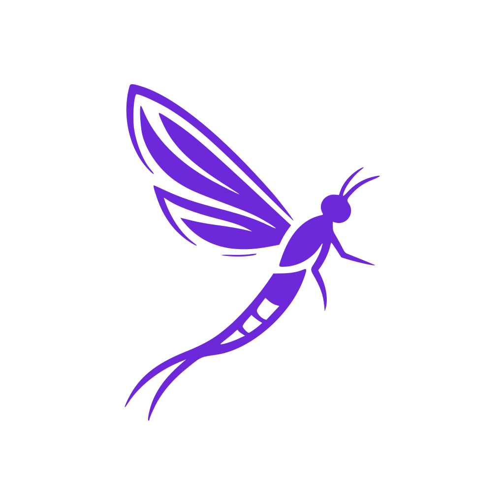
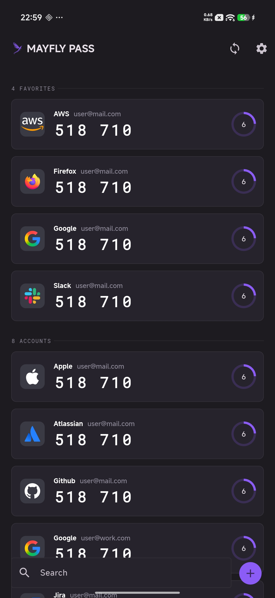
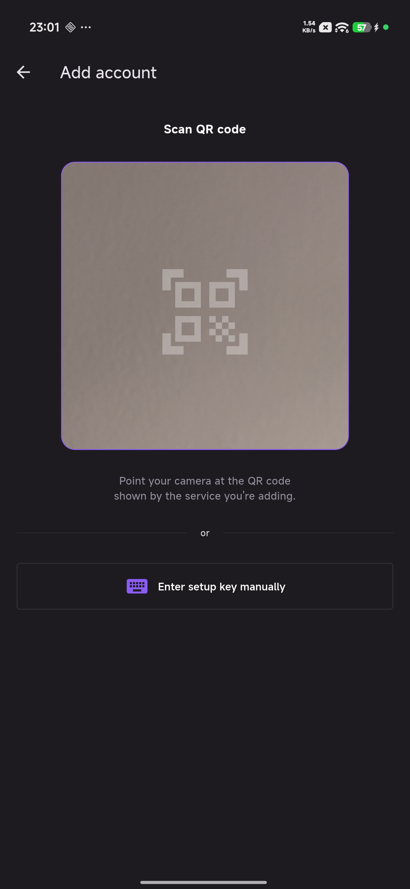
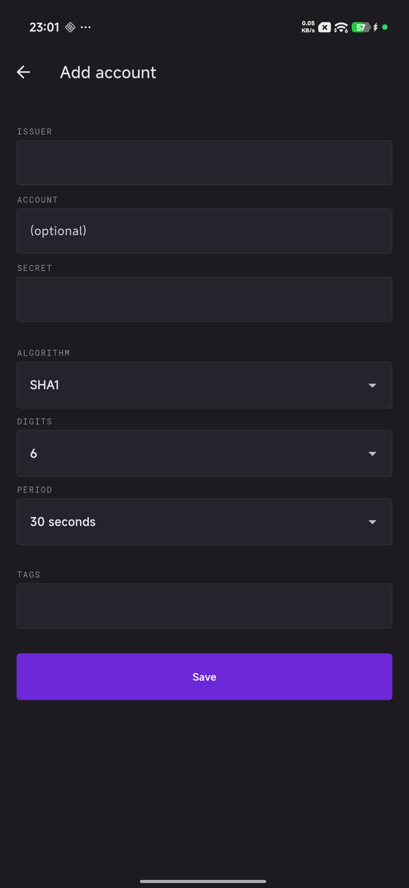
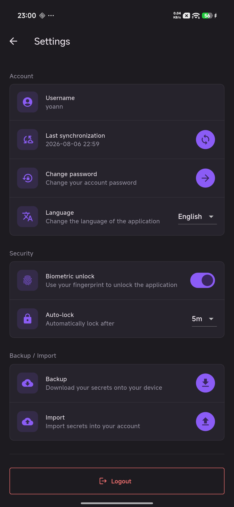

<a id="readme-top"></a>

[![Contributors][contributors-shield]][contributors-url]
[![Forks][forks-shield]][forks-url]
[![Stargazers][stars-shield]][stars-url]
[![Issues][issues-shield]][issues-url]
[![MIT License][license-shield]][license-url]

<br />
<div align="center">
  <a href="https://github.com/tuxlinuxien/mayflypass">
    
  </a>

  <h3 align="center">MayflyPass</h3>

  <p align="center">
    An end-to-end-encrypted TOTP manager, with a lightweight Rust API and a Flutter app that keeps your codes in sync across devices.
    <br />
    <a href="https://github.com/tuxlinuxien/mayflypass/issues/new?labels=bug">Report Bug</a>
    &middot;
    <a href="https://github.com/tuxlinuxien/mayflypass/issues/new?labels=enhancement">Request Feature</a>
  </p>
</div>

<details>
  <summary>Table of Contents</summary>
  <ol>
    <li>
      <a href="#about-the-project">About The Project</a>
      <ul>
        <li><a href="#encryption">Encryption</a></li>
        <li><a href="#built-with">Built With</a></li>
      </ul>
    </li>
    <li>
      <a href="#getting-started">Getting Started</a>
      <ul>
        <li><a href="#prerequisites">Prerequisites</a></li>
        <li><a href="#installation">Installation</a></li>
      </ul>
    </li>
    <li><a href="#usage">Usage</a></li>
    <li><a href="#roadmap">Roadmap</a></li>
    <li><a href="#contributing">Contributing</a></li>
    <li><a href="#license">License</a></li>
    <li><a href="#contact">Contact</a></li>
  </ol>
</details>

<!-- ABOUT THE PROJECT -->

## About The Project

| Home                                    | Add account (QR)                                                         | Add account (manual)                                                  | Settings                                        |
| --------------------------------------- | ------------------------------------------------------------------------ | --------------------------------------------------------------------- | ----------------------------------------------- |
|  |  |  |  |

MayflyPass is a monorepo containing two components:

- **`api/`** — A small, resource-efficient Rust backend that can run on very little hardware. It knows nothing about your TOTP secrets — it's a zero-knowledge blob store: storage only ever holds an encrypted key and an encrypted payload per item, both opaque to the server. Registration is gated behind a lightweight proof-of-work challenge to deter bots, and authentication uses short-lived tokens with a refresh/login/logout flow, backed by strong password hashing.
- **`app/`** — A Flutter app that manages your TOTP entries entirely client-side. Secrets are added either by scanning a QR code or manual entry, stored locally on the device, and displayed on the home screen with a live rotating code and countdown timer.

<p align="right">(<a href="#readme-top">back to top</a>)</p>

### Encryption

MayflyPass uses envelope encryption end-to-end, so the server only ever sees ciphertext:

- The master password is hashed using Argon2id.
- A KEK (key-encryption-key) is derived from that hash using HKDF.
- Each entry gets its own random 32-bytes DEK (data-encryption-key), which is encrypted with the KEK using XChaCha20-Poly1305.
- The TOTP codes themselves are encrypted with their DEK using XChaCha20-Poly1305.

<p align="right">(<a href="#readme-top">back to top</a>)</p>

### Built With

- [![Rust][Rust.io]][Rust-url]
- [![Axum][Axum.rs]][Axum-url]
- [![SQLite][SQLite.org]][SQLite-url]
- [![Flutter][Flutter.dev]][Flutter-url]
- [![Dart][Dart.dev]][Dart-url]

<p align="right">(<a href="#readme-top">back to top</a>)</p>

<!-- GETTING STARTED -->

## Getting Started

To get a local copy up and running follow these steps.

### Prerequisites

- Rust toolchain (`cargo`), for the API
- [Flutter Version Management (fvm)](https://fvm.app/), for the app
- `protoc`, to compile `proto/databox.proto` into the app's Dart bindings

### Installation

1. Clone the repo
   ```sh
   git clone git@github.com:tuxlinuxien/mayflypass.git
   ```
2. Run the API (SQLite database and migrations are handled automatically via sqlx)
   ```sh
   cd api
   cargo run
   ```
3. Build and run the app
   ```sh
   cd app
   fvm flutter pub get
   make build   # codegen, l10n, and protobuf bindings from proto/databox.proto
   fvm flutter run
   ```

<p align="right">(<a href="#readme-top">back to top</a>)</p>

<!-- USAGE EXAMPLES -->

## Usage

Current tested target devices:

- [x] Android
- [x] Linux

> **Note on iOS:** I don't have a Mac nor a developer account, so I can't test whether the app runs properly, and I'm sure the Podfiles are missing important updates. if you have the opportunity to run it, feel free to create a merge request on github.

<p align="right">(<a href="#readme-top">back to top</a>)</p>

<!-- ROADMAP -->

## Roadmap

- [ ] iOS support
- [ ] Windows support

See the [open issues](https://github.com/tuxlinuxien/mayflypass/issues) for a full list of proposed features (and known issues).

<p align="right">(<a href="#readme-top">back to top</a>)</p>

<!-- CONTRIBUTING -->

## Contributing

Contributions are what make the open source community such an amazing place to learn, inspire, and create. Any contributions you make are **greatly appreciated**.

If you have a suggestion that would make this better, please fork the repo and create a pull request. You can also simply open an issue with the tag "enhancement".

1. Fork the Project
2. Create your Feature Branch (`git checkout -b feature/AmazingFeature`)
3. Commit your Changes (`git commit -m 'Add some AmazingFeature'`)
4. Push to the Branch (`git push origin feature/AmazingFeature`)
5. Open a Pull Request

<p align="right">(<a href="#readme-top">back to top</a>)</p>

<!-- LICENSE -->

## License

Distributed under the MIT License. See `LICENSE` for more information.

<p align="right">(<a href="#readme-top">back to top</a>)</p>

<!-- CONTACT -->

## Contact

Project Link: [https://github.com/tuxlinuxien/mayflypass](https://github.com/tuxlinuxien/mayflypass)

<p align="right">(<a href="#readme-top">back to top</a>)</p>

<!-- MARKDOWN LINKS & IMAGES -->

[contributors-shield]: https://img.shields.io/github/contributors/tuxlinuxien/mayflypass.svg?style=for-the-badge
[contributors-url]: https://github.com/tuxlinuxien/mayflypass/graphs/contributors
[forks-shield]: https://img.shields.io/github/forks/tuxlinuxien/mayflypass.svg?style=for-the-badge
[forks-url]: https://github.com/tuxlinuxien/mayflypass/network/members
[stars-shield]: https://img.shields.io/github/stars/tuxlinuxien/mayflypass.svg?style=for-the-badge
[stars-url]: https://github.com/tuxlinuxien/mayflypass/stargazers
[issues-shield]: https://img.shields.io/github/issues/tuxlinuxien/mayflypass.svg?style=for-the-badge
[issues-url]: https://github.com/tuxlinuxien/mayflypass/issues
[license-shield]: https://img.shields.io/github/license/tuxlinuxien/mayflypass.svg?style=for-the-badge
[license-url]: https://github.com/tuxlinuxien/mayflypass/blob/master/LICENSE
[Rust.io]: https://img.shields.io/badge/rust-000000?style=for-the-badge&logo=rust&logoColor=white
[Rust-url]: https://www.rust-lang.org/
[Axum.rs]: https://img.shields.io/badge/axum-000000?style=for-the-badge
[Axum-url]: https://github.com/tokio-rs/axum
[SQLite.org]: https://img.shields.io/badge/sqlite-003B57?style=for-the-badge&logo=sqlite&logoColor=white
[SQLite-url]: https://www.sqlite.org/
[Flutter.dev]: https://img.shields.io/badge/flutter-02569B?style=for-the-badge&logo=flutter&logoColor=white
[Flutter-url]: https://flutter.dev/
[Dart.dev]: https://img.shields.io/badge/dart-0175C2?style=for-the-badge&logo=dart&logoColor=white
[Dart-url]: https://dart.dev/
